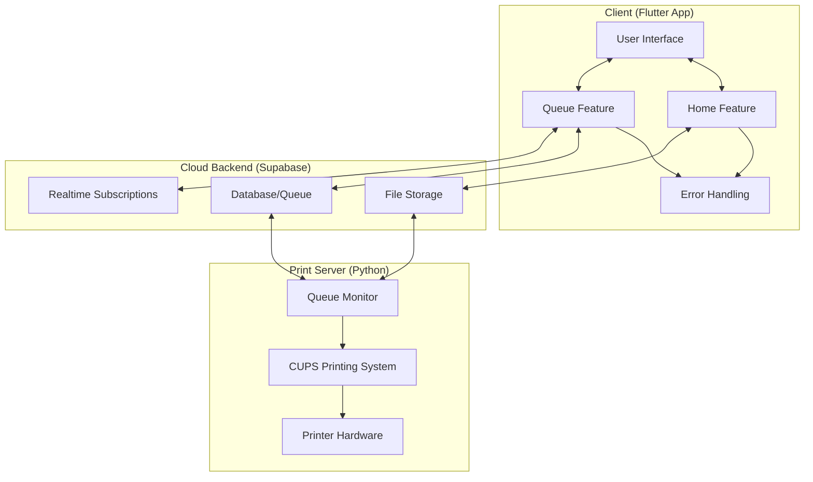
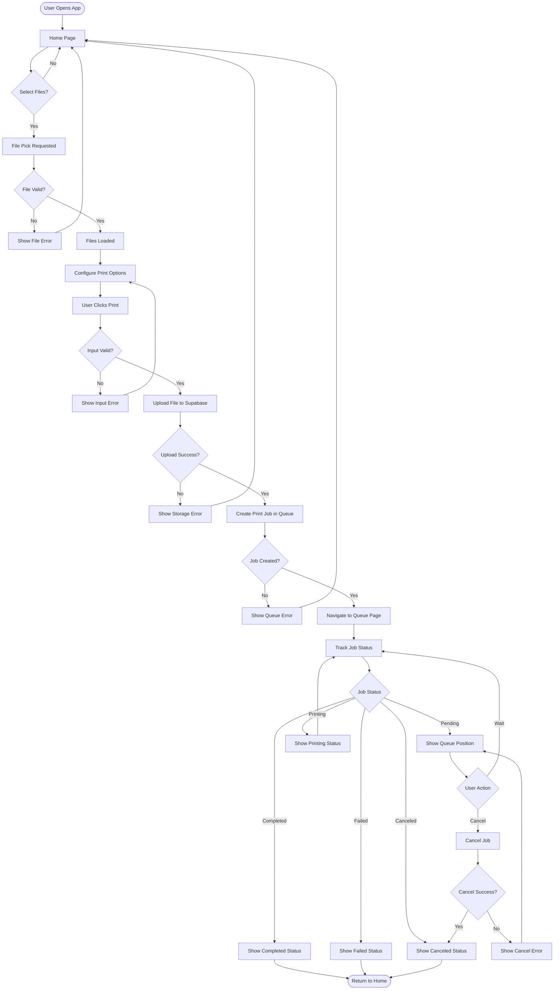
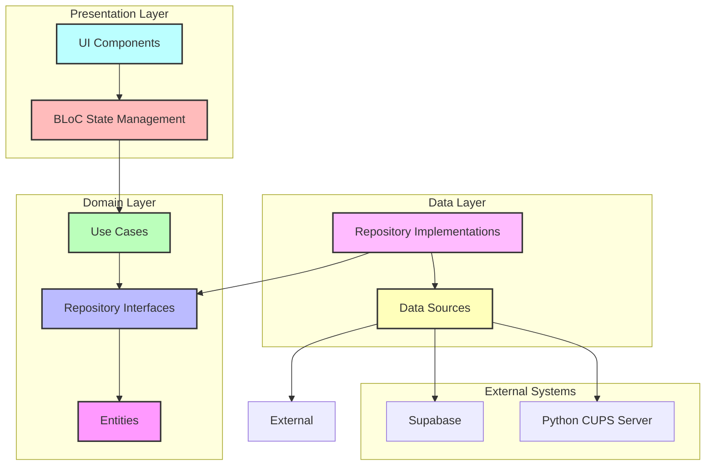
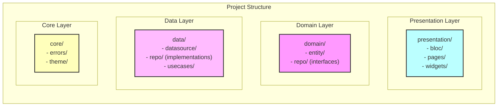
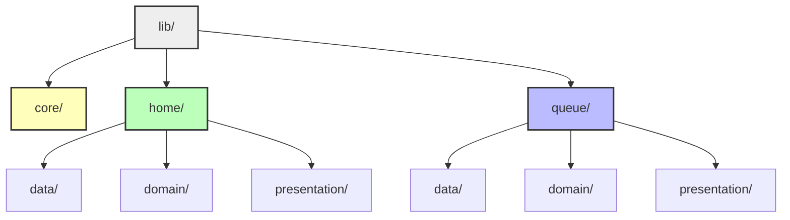
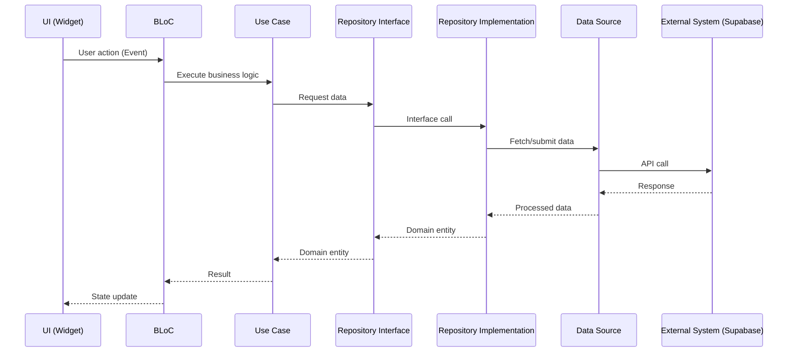
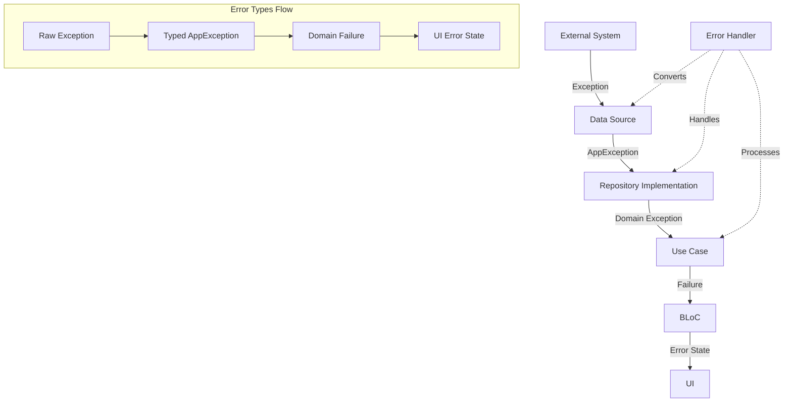
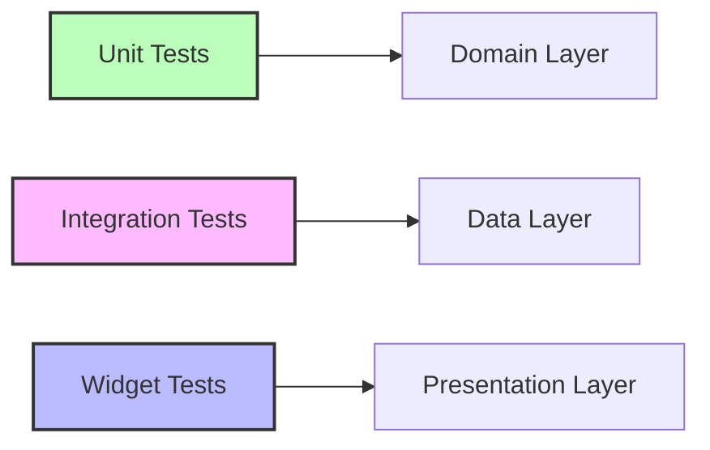

```mermaid
graph TD
    subgraph "Client (Flutter App)"
        UI[User Interface]
        HomeF[Home Feature]
        QueueF[Queue Feature]
        CoreE[Error Handling]
    end
    
    subgraph "Cloud Backend (Supabase)"
        Storage[File Storage]
        DB[Database/Queue]
        Realtime[Realtime Subscriptions]
    end
    
    subgraph "Print Server (Python)"
        CUPS[CUPS Printing System]
        Monitor[Queue Monitor]
        PrinterHW[Printer Hardware]
    end
    
    UI <--> HomeF
    UI <--> QueueF
    HomeF --> CoreE
    QueueF --> CoreE
    
    HomeF <--> Storage
    QueueF <--> DB
    QueueF <--> Realtime
    
    DB <--> Monitor
    Storage <--> Monitor
    Monitor --> CUPS
    CUPS --> PrinterHW

```

```mermaid
flowchart TD
    Start([User Opens App]) --> HomePage[Home Page]
    
    HomePage --> FileSelect{Select Files?}
    FileSelect -->|Yes| FilePickRequested[File Pick Requested]
    FileSelect -->|No| HomePage
    
    FilePickRequested --> FileAvailable{File Valid?}
    FileAvailable -->|No| FileError[Show File Error]
    FileError --> HomePage
    
    FileAvailable -->|Yes| FileLoaded[Files Loaded]
    FileLoaded --> ConfigurePrint[Configure Print Options]
    ConfigurePrint --> SubmitPrint[User Clicks Print]
    
    SubmitPrint --> InputValid{Input Valid?}
    InputValid -->|No| ShowInputError[Show Input Error]
    ShowInputError --> ConfigurePrint
    
    InputValid -->|Yes| UploadFile[Upload File to Supabase]
    
    UploadFile --> UploadSuccess{Upload Success?}
    UploadSuccess -->|No| StorageError[Show Storage Error]
    StorageError --> HomePage
    
    UploadSuccess -->|Yes| CreatePrintJob[Create Print Job in Queue]
    
    CreatePrintJob --> JobCreated{Job Created?}
    JobCreated -->|No| QueueError[Show Queue Error]
    QueueError --> HomePage
    
    JobCreated -->|Yes| NavigateToQueue[Navigate to Queue Page]
    NavigateToQueue --> TrackJob[Track Job Status]
    
    TrackJob --> JobStatus{Job Status}
    JobStatus -->|Pending| ShowPosition[Show Queue Position]
    JobStatus -->|Printing| ShowPrinting[Show Printing Status]
    JobStatus -->|Completed| ShowCompleted[Show Completed Status]
    JobStatus -->|Failed| ShowFailed[Show Failed Status]
    JobStatus -->|Canceled| ShowCanceled[Show Canceled Status]
    
    ShowPosition --> UserAction{User Action}
    UserAction -->|Cancel| CancelJob[Cancel Job]
    UserAction -->|Wait| TrackJob
    
    CancelJob --> CancelSuccess{Cancel Success?}
    CancelSuccess -->|Yes| ShowCanceled
    CancelSuccess -->|No| CancelError[Show Cancel Error]
    CancelError --> ShowPosition
    
    ShowPrinting --> TrackJob
    ShowCompleted --> End([Return to Home])
    ShowFailed --> End
    ShowCanceled --> End


```

```mermaid
graph TD
    subgraph "Presentation Layer"
        UI[UI Components]
        Bloc[BLoC State Management]
    end
    
    subgraph "Domain Layer"
        Entities[Entities]
        Repositories[Repository Interfaces]
        UseCases[Use Cases]
    end
    
    subgraph "Data Layer"
        RepoImpl[Repository Implementations]
        DataSources[Data Sources]
    end
    
    subgraph "External Systems"
        Supabase[Supabase]
        CUPS[Python CUPS Server]
    end
    
    UI --> Bloc
    Bloc --> UseCases
    UseCases --> Repositories
    Repositories --> Entities
    
    RepoImpl --> Repositories
    RepoImpl --> DataSources
    DataSources --> External
    
    DataSources --> Supabase
    DataSources --> CUPS
    
    style Entities fill:#f9f,stroke:#333,stroke-width:2px
    style Repositories fill:#bbf,stroke:#333,stroke-width:2px
    style UseCases fill:#bfb,stroke:#333,stroke-width:2px
    style RepoImpl fill:#fbf,stroke:#333,stroke-width:2px
    style DataSources fill:#ffb,stroke:#333,stroke-width:2px
    style UI fill:#bff,stroke:#333,stroke-width:2px
    style Bloc fill:#fbb,stroke:#333,stroke-width:2px
```

```mermaid
graph LR
    subgraph "Project Structure"
        subgraph "Presentation Layer"
            presentation["presentation/
            - bloc/
            - pages/
            - widgets/"]
        end
        
        subgraph "Domain Layer"
            domain["domain/
            - entity/
            - repo/ (interfaces)"]
        end
        
        subgraph "Data Layer"
            data["data/
            - datasource/
            - repo/ (implementations)
            - usecases/"]
        end
        
        subgraph "Core Layer"
            core["core/
            - errors/
            - theme/"]
        end
    end
    
    style presentation fill:#bff,stroke:#333,stroke-width:2px
    style domain fill:#f9f,stroke:#333,stroke-width:2px
    style data fill:#fbf,stroke:#333,stroke-width:2px
    style core fill:#ffb,stroke:#333,stroke-width:2px
```

```mermaid
graph TD
    root["lib/"]
    core["core/"]
    home["home/"]
    queue["queue/"]
    
    root --> core
    root --> home
    root --> queue
    
    home --> home_data["data/"]
    home --> home_domain["domain/"]
    home --> home_presentation["presentation/"]
    
    queue --> queue_data["data/"]
    queue --> queue_domain["domain/"]
    queue --> queue_presentation["presentation/"]
    
    style root fill:#eee,stroke:#333,stroke-width:2px
    style core fill:#ffb,stroke:#333,stroke-width:2px
    style home fill:#bfb,stroke:#333,stroke-width:2px
    style queue fill:#bbf,stroke:#333,stroke-width:2px
```

```mermaid
sequenceDiagram
    participant UI as UI (Widget)
    participant Bloc as BLoC
    participant UseCase as Use Case
    participant Repo as Repository Interface
    participant RepoImpl as Repository Implementation
    participant DataSource as Data Source
    participant External as External System (Supabase)
    
    UI->>Bloc: User action (Event)
    Bloc->>UseCase: Execute business logic
    UseCase->>Repo: Request data
    Repo->>RepoImpl: Interface call
    RepoImpl->>DataSource: Fetch/submit data
    DataSource->>External: API call
    External-->>DataSource: Response
    DataSource-->>RepoImpl: Processed data
    RepoImpl-->>Repo: Domain entity
    Repo-->>UseCase: Domain entity
    UseCase-->>Bloc: Result
    Bloc-->>UI: State update
```

```mermaid
flowchart TD
    External[External System] -->|Exception| DataSource
    DataSource[Data Source] -->|AppException| RepoImpl
    RepoImpl[Repository Implementation] -->|Domain Exception| UseCase
    UseCase[Use Case] -->|Failure| Bloc
    Bloc[BLoC] -->|Error State| UI
    
    ErrorHandler[Error Handler] -.->|Converts| DataSource
    ErrorHandler -.->|Handles| RepoImpl
    ErrorHandler -.->|Processes| UseCase
    
    subgraph "Error Types Flow"
        Exception[Raw Exception]
        AppException[Typed AppException]
        Failure[Domain Failure]
        ErrorState[UI Error State]
        
        Exception --> AppException
        AppException --> Failure
        Failure --> ErrorState
    end
```

```mermaid
graph LR
    UnitTest[Unit Tests] --> DomainLayer[Domain Layer]
    IntegrationTest[Integration Tests] --> DataLayer[Data Layer]
    WidgetTest[Widget Tests] --> PresentationLayer[Presentation Layer]
    
    style UnitTest fill:#bfb,stroke:#333,stroke-width:2px
    style IntegrationTest fill:#fbf,stroke:#333,stroke-width:2px
    style WidgetTest fill:#bbf,stroke:#333,stroke-width:2px
```

```mermaid
flowchart TD
    External[External System] -->|Exception| DataSource
    DataSource[Data Source] -->|AppException| RepoImpl
    RepoImpl[Repository Implementation] -->|Domain Exception| UseCase
    UseCase[Use Case] -->|Failure| Bloc
    Bloc[BLoC] -->|Error State| UI
    
    ErrorHandler[Error Handler] -.->|Converts| DataSource
    ErrorHandler -.->|Handles| RepoImpl
    ErrorHandler -.->|Processes| UseCase
    
    subgraph "Error Types Flow"
        Exception[Raw Exception]
        AppException[Typed AppException]
        Failure[Domain Failure]
        ErrorState[UI Error State]
        
        Exception --> AppException
        AppException --> Failure
        Failure --> ErrorState
    end
```